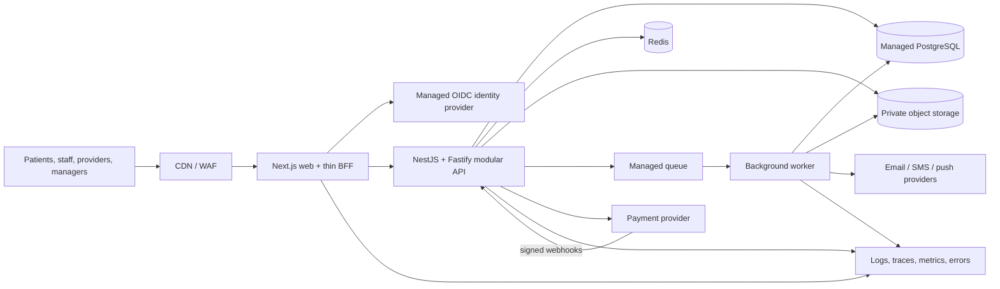

# Royal Palace Health Care — Production Backend Implementation Plan

**Status:** Implementation handoff specification

**Audience:** Engineering team, agent builder, product owner, security/privacy reviewers

**Purpose:** Replace the current prototype data and trust model with a secure, observable, maintainable production platform while preserving and progressively connecting the existing frontend.

> **Instruction to the implementation agent:** Treat this document as the controlling implementation specification. Do not implement the whole plan as one large change. Execute the numbered delivery increments in Section 19 in order, produce the evidence required by Section 20, and stop at every approval gate. Where this document says “must,” the instruction is mandatory. If the repository conflicts with this plan, document the conflict and stop for a decision instead of silently changing the architecture.

### Required first response from the implementation agent

Before writing code, the agent must return:

1. the repository root, active branch, and concise dirty-worktree summary;
2. the current build/test/type-check results and known baseline failures;
3. the current increment it will execute—starting with Increment 00 unless a signed completion report proves it is already complete;
4. the exact files/modules it expects to touch;
5. unresolved human decisions and whether any stop condition applies;
6. the verification commands it will run;
7. a statement that it will preserve unrelated user changes and will not combine later increments into the current change.

The agent may perform read-only discovery to produce this response. It must not start a later increment, redesign the UI, install unapproved infrastructure dependencies, or rewrite existing modules before the relevant gate is accepted.

## 1. Executive decision

The existing application must **not** be released publicly in its current form. It is a useful product prototype, but its authentication, authorization, data storage, payment handling, file storage, audit coverage, and operational controls are not production-safe for a healthcare platform.

The recommended production shape is:

- Keep **Next.js** for the web frontend and a thin Backend-for-Frontend (BFF) layer.
- Build a separate **TypeScript modular-monolith API** using **NestJS with the Fastify adapter**.
- Build a separate **background worker** for webhooks, notifications, document processing, reconciliations, and scheduled work.
- Use managed **PostgreSQL** as the source of truth.
- Use **Redis** only for bounded cache, rate limiting, and short-lived coordination—not as a system of record.
- Store documents in private **S3-compatible object storage**, never as base64 blobs in the relational database.
- Use a managed identity provider and secure server-managed sessions; never trust a role or user identity supplied by the browser.
- Integrate payments through hosted provider checkout and verified, idempotent webhooks. Never store card PAN or CVV.
- Start with one deployable API and one worker. Do **not** begin with microservices.

This is a production migration, not a database swap. Replacing SQLite with PostgreSQL without replacing the current trust and workflow boundaries would retain the most serious risks.

## 2. Honest release position

Public launch is controlled by release gates, not by a date. “Code complete” is not sufficient for a healthcare platform.

A focused first production release—hospital/service discovery, organization onboarding, patient accounts, appointment booking, hosted payments, manager attribution, and support—can reasonably take **12–16 weeks** with an experienced cross-functional team of roughly 4–6 engineers plus QA, DevOps, security/privacy, and clinical review.

Releasing the full current scope—clinical records, consultations, prescriptions, laboratories, pharmacies, logistics, payouts, and all administrative workflows—should be planned as approximately **20–32 weeks**, depending on integrations, regulatory review, and team size. A solo developer or agent-led implementation will take longer and still requires independent human security, privacy, and clinical review.

The release must remain private until every launch gate in Section 14 passes.

## 3. Current prototype risks that must be retired

The implementation agent must treat the following as release blockers:

1. Passwords are stored and compared in plain text.
2. Session and role data are kept in browser storage and sent in a client-controlled header.
3. Generic dynamic CRUD endpoints expose broad database operations without consistent resource authorization.
4. Several state-changing endpoints accept actor, patient, or organization identifiers from the request body instead of deriving identity from the authenticated principal.
5. Payment success is simulated rather than confirmed by a payment-provider webhook.
6. Clinical uploads can be stored as base64 data in the database/browser instead of private object storage.
7. Build-time TypeScript errors are ignored.
8. Database workflow includes `db push --accept-data-loss`, which must never be used in production.
9. Roles, statuses, and lifecycle rules rely heavily on unrestricted strings and application conventions.
10. Authorization, clinical audit, consent, retention, backup, recovery, monitoring, and incident-response coverage are incomplete.
11. Prototype credentials, placeholder workflows, and demo data are present.
12. Automated test coverage is far below what is required for public launch.

Do not preserve any of these behaviors merely for backward compatibility. Preserve the visible product experience where useful, but replace the underlying trust model.

## 4. Target architecture



### Initial deployable units

1. `web`: Next.js application and same-origin BFF endpoints.
2. `api`: the modular production API.
3. `worker`: asynchronous and scheduled processing.

This keeps operational complexity reasonable while establishing clean boundaries. Split a module into its own service only after production evidence shows a distinct scaling, reliability, compliance, or team-ownership boundary.

## 5. Repository structure

Migrate gradually to a monorepo without stopping frontend development:

```text
apps/
  web/                 Existing Next.js frontend, progressively migrated
  api/                 NestJS + Fastify API
  worker/              Queue consumers and scheduled jobs
packages/
  contracts/           OpenAPI-generated client and shared API schemas
  ui/                  Reusable presentation components only
  config/              Shared lint, TypeScript, test, and environment rules
  testing/             Test factories, fixtures, and contract helpers
infra/
  environments/        Development, staging, and production IaC
  modules/             Reusable infrastructure modules
docs/
  adr/                  Architecture decision records
  runbooks/             Operational and incident runbooks
```

Use `pnpm` workspaces with Turborepo, unless the team has already standardized on another workspace tool. Migration to this layout is not permission for a full frontend rewrite.

## 6. Core engineering rules

These rules apply to every phase and every implementation agent.

### API and data

- Publish versioned REST APIs under `/v1` and describe them with OpenAPI 3.1.
- Generate the frontend TypeScript client from the OpenAPI document. Do not hand-maintain duplicate request/response interfaces.
- Validate every request at the API boundary and reject unknown fields for security-sensitive commands.
- Return a consistent RFC 7807-style error shape with a request/correlation ID.
- Use cursor pagination for large and growing datasets.
- Represent money as integer minor units plus an ISO currency code. Never use floating point.
- Store timestamps in UTC and localize only at display boundaries.
- Use explicit database enums or constrained lookup values for bounded lifecycle states.
- Add database foreign keys, uniqueness rules, check constraints, and indexes that enforce domain invariants.
- Use transactions for multi-record state changes and an outbox/inbox pattern for reliable asynchronous side effects.
- Require idempotency keys for retryable financial and externally triggered commands.
- Prevent N+1 queries; select only fields required by the use case; paginate all lists.
- Use Prisma migrations in source control. Never use `db push`, destructive migration flags, or ad-hoc production schema edits.

### Security and privacy

- Default deny: every endpoint requires an explicit authentication and authorization decision.
- Derive actor identity, role, tenant, and ownership from the validated session—not request payloads or headers controlled by application JavaScript.
- Use short-lived server-side/session-bound authentication in `HttpOnly`, `Secure`, `SameSite` cookies through the BFF.
- Require MFA for administrators, support staff, providers, pharmacies, laboratories, hospitals, logistics staff, and managers.
- Apply RBAC for broad role permissions and ABAC for organization membership, patient relationship, consent, assignment, and resource ownership.
- Audit all access to clinical or sensitive records, including reads, exports, permission changes, and failed privileged actions.
- Never put secrets, tokens, health data, full payment details, or unnecessary personal data in logs.
- Encrypt data in transit and at rest. Manage keys and secrets outside the source repository.
- Use private object storage with short-lived presigned upload/download URLs, file-type and size validation, malware scanning, encryption, and retention policies.
- Use hosted/tokenized payment collection. Store only provider references and permitted metadata.

### Maintainability

- Organize code by business capability, not by database table.
- Keep controllers thin; put rules in application/domain services and persistence in repositories.
- Do not expose a generic public CRUD layer.
- Name constants and configuration explicitly; avoid magic values and hard-coded assumptions.
- Comment only non-obvious intent and constraints, not syntax.
- Each change must include tests, migration impact, observability, documentation, and rollback notes.
- TypeScript, lint, unit, integration, and build failures must block merging.

## 7. Backend domain modules

The modular monolith should contain these explicit modules:

1. **Identity and Access** — principals, sessions, MFA, role assignments, organization memberships, device/session revocation.
2. **Users and Profiles** — patient and workforce identities, contact verification, communication preferences.
3. **Organizations and Credentialing** — pharmacies, laboratories, hospitals, providers, logistics organizations, submitted evidence, verification decisions.
4. **Hospital Discovery** — facilities, locations, offered services, service taxonomy, availability metadata, search/filter indexes.
5. **Patient Consent and Access** — consent records, purpose, scope, access grants, expiration, revocation, emergency access policy.
6. **Scheduling and Consultation** — availability, appointments, cancellations, check-in, encounter linkage.
7. **Clinical Encounters** — clinical notes, diagnoses, observations, signed state, versioned amendments, provenance.
8. **Prescriptions and Pharmacy** — prescriptions, dispensing workflow, inventory-facing requests, orders, fulfilment.
9. **Laboratories** — lab catalog, requests, specimen lifecycle, results, verification and provenance.
10. **Logistics** — shipments, assignments, status events, proof of delivery.
11. **Payments and Ledger** — payment intents/references, webhook events, refunds, immutable ledger entries, reconciliation.
12. **Settlements and Payouts** — organization settlements, manager earnings, payout approvals, provider references.
13. **Manager Attribution** — immutable referral link/campaign attribution, eligible activity rules, commission policy versioning. Managers see their earnings and minimal referral status, never patient payments or full patient/organization records.
14. **Support** — tickets, minimal manager-visible identity fields, escalation, assignment, internal notes, SLA events.
15. **Notifications** — templates, preferences, delivery attempts, suppression, retries.
16. **Audit and Compliance** — security events, clinical access logs, exports, retention and DSAR workflows.

Module APIs must communicate through application services or durable events, not by reaching directly into another module’s tables.

## 8. Frontend migration strategy

Use a **strangler migration**. Keep the existing frontend operational in development while replacing prototype services one vertical slice at a time.

1. Introduce the generated API client and a single authenticated fetch wrapper.
2. Add same-origin BFF session endpoints and remove local-storage session authority.
3. Put migrated features behind environment-controlled feature flags.
4. Convert each screen from direct/generic resource calls to use-case-specific endpoints.
5. Keep presentation components where they remain valid; replace state, validation, error handling, and data fetching as needed.
6. Add loading, empty, retry, expired-session, forbidden, conflict, and failure states to every migrated flow.
7. Remove the corresponding prototype route and mock fallback immediately after a slice passes acceptance tests.
8. Do not allow production builds to silently fall back to demo data.

Recommended migration order:

1. Authentication/session shell.
2. Public hospital, pharmacy, laboratory, and provider discovery.
3. Organization onboarding and administrative verification.
4. Patient profile, manager referral attribution, and consent.
5. Appointment booking and consultation lifecycle.
6. Hosted payment initiation and payment status.
7. Manager earnings/reporting and restricted support visibility.
8. Prescriptions/pharmacy, laboratories, logistics.
9. Clinical records and record-access workflows.
10. Settlements, payouts, reconciliation, and advanced reporting.

## 9. Phased implementation

### Phase 0 — Scope, safety, and production design (1–2 weeks)

**Goal:** agree what the first public release contains and define the system’s safety and compliance boundaries before implementation.

**Work:**

- Create a complete feature and external-integration inventory.
- Classify data: public, internal, personal, sensitive personal, clinical, financial, credential/secrets.
- Define initial launch scope and explicit deferred features.
- Produce a threat model and abuse-case review for each role and public endpoint.
- Begin Nigeria Data Protection Act readiness work: controller/processor roles, lawful bases, DPIA, records of processing, retention schedule, DSAR, breach response, processor/vendor agreements, and cross-border transfer assessment.
- Confirm clinical governance and obtain qualified legal/privacy and clinical-safety review.
- Define SLOs, RTO/RPO, environments, deployment region, data residency, backup, and support/on-call ownership.
- Write ADRs for architecture, identity provider, database, cloud, payment provider, object storage, queue, and observability.
- Define the canonical role/permission matrix and sensitive-field visibility matrix.

**Exit gate:** product owner, engineering lead, security/privacy owner, and clinical reviewer approve launch scope, data map, threat model, permission matrix, RTO/RPO, and ADRs.

### Phase 1 — Engineering and infrastructure foundation (1–2 weeks)

**Goal:** create repeatable development, staging, and production foundations.

**Work:**

- Introduce the monorepo structure while preserving current frontend behavior.
- Scaffold API and worker with health, readiness, structured logging, request IDs, graceful shutdown, and configuration validation.
- Provision isolated development, staging, and production resources through IaC.
- Provision managed PostgreSQL, Redis, object storage, queue, secret manager, encryption keys, logging, metrics, and tracing.
- Configure CI/CD with protected environments and manual production promotion.
- Make TypeScript checking, linting, tests, migration validation, dependency review, secret scanning, and builds mandatory.
- Remove `ignoreBuildErrors`, enable strict behavior where practical, and remove production dependence on platform-specific shell commands.
- Establish migration, rollback, backup, restore, and synthetic seed-data workflows.

**Exit gate:** a no-business-logic release deploys to development and staging from CI; database migrations run safely; telemetry works; rollback and backup/restore procedures are demonstrated.

### Phase 2 — Identity, sessions, and authorization (2–3 weeks)

**Goal:** establish the trust boundary before moving business data.

**Work:**

- Integrate a managed OIDC/OAuth 2.0 identity provider.
- Implement verified email/phone flows, secure recovery, session expiration, refresh rotation, revocation, and device/session management.
- Require MFA for privileged/workforce roles.
- Implement secure BFF session cookies with CSRF protection where applicable.
- Define RBAC + ABAC policy functions and test every role/resource/action combination.
- Create explicit organization membership and staff assignment models.
- Add rate limits, login abuse controls, security-event auditing, and account lock/recovery policy.
- Replace plaintext passwords, `localStorage` session authority, and `x-rp-session` trust.
- Remove all default/demo production credentials.

**Exit gate:** independent tests prove that browser-controlled identity/role changes cannot elevate access; all privileged roles use MFA; authorization defaults to deny; session revocation works; no plaintext password or local-storage bearer/session credential remains.

### Phase 3 — PostgreSQL domain foundation (2–4 weeks)

**Goal:** establish constrained, auditable production data models and access patterns.

**Work:**

- Redesign the Prisma schema for PostgreSQL by domain module.
- Replace free-form lifecycle strings with enums/check constraints where appropriate.
- Add foreign keys, unique constraints, optimistic concurrency/version fields, timestamps, provenance, and required indexes.
- Separate authentication identity, profile data, organization data, clinical data, and financial ledger concerns.
- Add consent/access-grant models, immutable audit events, retention metadata, and soft deletion only where domain-appropriate.
- Add repository/application service boundaries and query budgets for list and dashboard endpoints.
- Use row-level security only as defense in depth for suitable tables; API authorization remains mandatory.
- Create safe expand/migrate/contract migration rules and automated migration checks.

**Exit gate:** schema and representative queries pass architecture review; constraints enforce critical invariants; query plans and pagination meet agreed budgets; backup restoration has been tested; no generic public CRUD access exists.

### Phase 4 — Production vertical slices and frontend connection (4–8 weeks)

**Goal:** replace prototype functionality with complete, secure user journeys.

Implement each slice end to end: schema, migration, service, authorization, API contract, generated client, UI integration, audit, telemetry, tests, documentation, and rollback.

**Slice A — Discovery:** hospital/service taxonomy, location and service filters, pharmacy/laboratory/provider discovery, indexed search, public-safe response projections.

**Slice B — Onboarding and verification:** patient and organization applications, evidence uploads, support review, admin-only approve/reject/request-more-information decisions, decision history, notifications.

**Slice C — Patient and manager attribution:** patient profile, referral-link attribution, immutable attribution history, manager-visible minimal status, privacy boundaries.

**Slice D — Appointments and encounters:** provider availability, race-safe booking, cancellation, check-in, encounter creation, clinical ownership and consent checks.

**Slice E — Manager and support:** earnings summaries by daily/monthly/custom ranges, minimal ticket escalation data, ticket follow-up, no patient payment amount disclosure, no full patient/organization records.

**Slice F — Pharmacy, laboratory, and logistics:** explicit order/request/status state machines, fulfillment permissions, verified result/dispense events, delivery audit trail.

**Exit gate per slice:** contract, integration, authorization matrix, and end-to-end tests pass; prototype endpoint removed; no mock/demo fallback in production; dashboards avoid N+1 queries and paginate growing lists.

### Phase 5 — Payments, files, and asynchronous integrations (2–4 weeks)

**Goal:** make external side effects reliable, verifiable, and reconcilable.

**Work:**

- Integrate hosted Paystack or Flutterwave checkout/tokenization.
- Create server-side payment intents/references and verify signed webhook requests.
- Store webhook events in an inbox with provider event uniqueness and idempotent processing.
- Treat the verified provider event and reconciliation process—not browser redirect—as payment authority.
- Implement an immutable double-entry-style internal ledger for money movement and commission allocation.
- Version commission rules and preserve the exact rule used for each earning.
- Implement refunds, reversals, failed payments, settlement states, payout approval, and reconciliation reports.
- Move files to private object storage using presigned uploads, validation, malware scan/quarantine, metadata, and authorized downloads.
- Process email, SMS, webhook, scanning, and reconciliation work through queues with bounded retry and dead-letter handling.

**Exit gate:** duplicate/out-of-order webhooks cannot duplicate money or commissions; reconciliation balances; refund/reversal paths are tested; no PAN/CVV is stored; file authorization and malware handling are verified.

### Phase 6 — Clinical integrity and privacy operations (2–4 weeks)

**Goal:** protect patient safety and make sensitive-data handling operationally real.

**Work:**

- Implement signed/locked clinical records and versioned amendments instead of destructive overwrite.
- Record author, organization, timestamps, status transitions, and source/provenance.
- Enforce patient relationship, assignment, consent, and purpose-of-use rules on clinical access.
- Audit every sensitive read, mutation, export, and permission decision.
- Implement data-subject request, export, correction, restriction, and approved deletion/anonymization workflows.
- Automate retention rules with legal/clinical hold support.
- Define emergency access (“break glass”) only if approved, with reason, elevated audit, and immediate review.
- Validate prescription, lab-result, and referral workflows with qualified clinical stakeholders.

**Exit gate:** clinical safety review passes; signed data cannot be silently rewritten; sensitive access is reconstructable from audit logs; DSAR and retention workflows are demonstrated using staging data.

### Phase 7 — Security, reliability, and performance qualification (2–3 weeks)

**Goal:** prove production readiness under failure and hostile conditions.

**Work:**

- Use OWASP ASVS Level 2 as the minimum verification baseline, with stronger controls for high-risk functions.
- Run SAST, dependency, secret, IaC, container, and dynamic security scans in CI/CD.
- Commission an independent penetration test and remediate all critical/high findings plus accepted medium-risk launch blockers.
- Add unit, integration, contract, authorization, end-to-end, migration, webhook, and failure-mode tests.
- Run load, spike, and soak tests using privacy-safe synthetic data.
- Establish service dashboards and SLO alerts for availability, latency, errors, queues, database saturation, login failures, payment/webhook delays, and notification failures.
- Test point-in-time database recovery, object recovery, queue failure, provider outage, credential rotation, and region/service degradation procedures.
- Finalize incident response, escalation, on-call, status communication, and security-breach runbooks.

**Exit gate:** performance budgets and SLOs pass; restore drill meets RTO/RPO; independent security findings are resolved/accepted by accountable owners; alerts page the correct responder; rollback is rehearsed.

### Phase 8 — Migration, controlled launch, and rollback (1–2 weeks)

**Goal:** release a narrow, supportable production scope safely.

**Work:**

- Do not migrate prototype/demo accounts or synthetic clinical/payment records into production.
- Rehearse the exact cutover and rollback in staging.
- Complete UAT for every in-scope role and critical journey.
- Verify production provider accounts, webhook secrets, DNS/TLS, email/SMS identities, legal pages, support contacts, and monitoring.
- Run a controlled internal/pilot release, then a low-percentage canary release.
- Monitor error rate, latency, authorization failures, payment reconciliation, queue backlog, and support volume before expanding access.
- Maintain an explicit rollback decision owner and criteria.

**Exit gate:** every launch gate in Section 14 is signed off; canary metrics remain healthy for the agreed period; operations and support teams confirm readiness.

### Phase 9 — Post-launch operation (ongoing)

- Review sensitive-access and privileged-action audits.
- Patch dependencies and base images on a defined SLA.
- Repeat restore and disaster-recovery drills.
- Run periodic penetration tests and access reviews.
- Monitor capacity and query performance; add indexes/caching only from evidence.
- Review commission and settlement reconciliations.
- Measure product and reliability SLOs.
- Extract services only when measured production needs justify the cost.

## 10. Testing strategy

Required test layers:

- **Unit:** domain rules, calculations, state transitions, policy functions.
- **Integration:** repositories against real PostgreSQL, transactions, migrations, queues, object-storage adapters.
- **Authorization matrix:** every role × resource × action, including ownership/assignment/consent boundaries.
- **Contract:** OpenAPI compatibility and generated client behavior.
- **End-to-end:** critical user journeys in an isolated staging-like environment.
- **Webhook/idempotency:** duplicates, reordering, delay, signature failure, partial processing, retry.
- **Migration:** forward, rollback/repair strategy, backward-compatible deployment windows.
- **Performance:** representative search, dashboards, availability, booking contention, audit writes, reconciliation.
- **Security:** abuse cases, session handling, CSRF, injection, object-level authorization, rate limits, upload attacks, sensitive-data leakage.

Tests must use factories and synthetic data. Production personal or clinical data must never be copied into development or ordinary test environments.

## 11. Observability and operational targets

Define exact numbers in Phase 0. A reasonable starting proposal is:

- 99.9% monthly availability for patient-facing core APIs after stabilization.
- p95 API latency under 500 ms for ordinary reads and under 1 second for ordinary commands, excluding provider-dependent completion.
- Search targets defined separately by expected dataset size.
- Zero un-reconciled duplicate financial postings.
- RPO of 15 minutes or better and RTO of 4 hours or better for the first release, tightened as usage and clinical dependence grow.
- High-severity security and payment alerts routed 24/7 to a named responder.

Every request and background job must carry a correlation ID. Metrics should be low-cardinality; logs must be structured and redacted; traces must not capture sensitive payloads.

## 12. Recommended delivery team

For the full scope, plan for:

- 1 technical lead/backend architect.
- 2 backend engineers.
- 2 frontend engineers.
- 1 DevOps/SRE engineer.
- 1 QA automation engineer.
- Product and UX ownership.
- Part-time security engineer, privacy/DPO/legal counsel, and clinical-safety advisor.

One person may cover multiple responsibilities in a smaller team, but the independent security/privacy/clinical review responsibilities must not disappear.

## 13. Agent-builder execution instructions

The agent builder must follow these instructions exactly:

1. Work one approved phase and one vertical slice at a time. Do not start a later phase before the current exit gate is accepted.
2. Before editing, inventory affected routes, UI screens, data models, tests, and security boundaries.
3. Propose or update an ADR for any material architectural choice; do not introduce a new infrastructure dependency silently.
4. Preserve the current frontend visual language unless a change is required for accessibility, truthful state, security, or error handling.
5. Never copy prototype authentication, generic CRUD, simulated payment, browser-trusted identifiers, demo credentials, or base64 file patterns into production code.
6. Every endpoint must define authentication, authorization, input schema, output projection, error cases, audit behavior, rate limits, idempotency needs, and tests.
7. Every schema change must be a reviewed migration with deployment order, backfill plan, indexes, compatibility window, and rollback/repair notes.
8. Every list endpoint must paginate and have an index/query-plan review. Every dashboard must use bounded aggregate queries and avoid per-row follow-up queries.
9. Every external call must have timeout, safe retry policy, circuit/failure behavior, telemetry, and a test double.
10. Never commit secrets or real patient/payment data. Never log sensitive payloads.
11. Do not disable type checking, linting, tests, authorization checks, or certificate verification to make a build pass.
12. Do not use `prisma db push` in staging or production. Do not use destructive migration flags.
13. Do not add mock fallbacks to production paths. Feature-flag incomplete functionality off.
14. At the end of each implementation, provide:
    - files and behavior changed;
    - API/schema/migration impact;
    - authorization and privacy impact;
    - tests and exact results;
    - performance/query review;
    - observability and rollback notes;
    - confirmation that the code is readable, well-structured, maintainable, extensible, free of unjustified magic values/hard-coded assumptions, and avoids unnecessary queries.
15. Stop and escalate when a requirement affects legal basis, clinical safety, payment custody, data residency, or irreversible production data behavior.

## 14. Public-launch gates

Public launch is prohibited until all of the following are true:

- [ ] Approved launch scope and deferred-feature list.
- [ ] Production identity provider, secure cookies, MFA, session revocation, and default-deny authorization.
- [ ] No plaintext passwords, browser-trusted roles, generic public CRUD, demo credentials, or production mock data.
- [ ] PostgreSQL constraints, migrations, indexes, backups, point-in-time recovery, and restore drill verified.
- [ ] Private object storage, malware scanning, file authorization, and retention implemented.
- [ ] Hosted payments, signed idempotent webhooks, ledger, refunds, and reconciliation verified.
- [ ] Sensitive/clinical access auditing and approved consent model implemented.
- [ ] NDPA readiness, privacy notices, processor agreements, DSAR, retention, and incident processes signed off by qualified reviewers.
- [ ] Clinical workflows signed off by qualified clinical stakeholders.
- [ ] OWASP ASVS-based review completed.
- [ ] Independent penetration test completed and launch-blocking findings resolved.
- [ ] Contract, integration, authorization, end-to-end, migration, webhook, and performance suites pass.
- [ ] RTO/RPO restore and rollback rehearsals pass.
- [ ] Monitoring, alerting, on-call, incident response, and customer support are active.
- [ ] Production secrets, provider accounts, DNS/TLS, legal pages, and operational ownership verified.
- [ ] Controlled pilot/canary succeeds before general access.

## 15. First two-week execution backlog

The first sprint should produce decisions and foundations, not rush into feature endpoints:

1. Approve the narrow first-release scope.
2. Complete data classification and role/field visibility matrices.
3. Produce threat model and top abuse cases.
4. Select cloud/region, identity provider, payment provider, object storage, queue, and observability stack.
5. Set SLO, RTO, and RPO targets.
6. Create ADRs and the production environment diagram.
7. Introduce monorepo workspace structure without altering user-facing behavior.
8. Scaffold API and worker with health/readiness/config validation/structured logging.
9. Provision development and staging PostgreSQL through IaC.
10. Add mandatory CI gates and remove ignored TypeScript build errors.
11. Draft the production identity and authorization model.
12. Create the first OpenAPI contract for session/current-user and public hospital discovery.

At sprint end, review the Phase 0 exit gate before authorizing Phase 1/2 implementation.

## 16. External standards and authoritative references

- [Next.js Backend-for-Frontend guide](https://nextjs.org/docs/app/guides/backend-for-frontend) — Route Handlers are public HTTP endpoints and Next.js backend features are not a full backend replacement.
- [OWASP Application Security Verification Standard](https://owasp.org/projects/asvs/) — application security verification baseline.
- [NIST SP 800-63-4 Digital Identity Guidelines](https://pages.nist.gov/800-63-4/) and [authentication requirements](https://pages.nist.gov/800-63-4/sp800-63b.html).
- [Nigeria Data Protection Act 2023 — NDPC](https://ndpc.gov.ng/download/nigeria-data-protection-act-2023) and [NDPC resources](https://ndpc.gov.ng/resources/).
- [PCI DSS document library](https://www.pcisecuritystandards.org/document_library/) and [PCI DSS v4.0.1 publication notice](https://blog.pcisecuritystandards.org/just-published-pci-dss-v4-0-1).
- [Paystack webhook guidance](https://paystack.com/docs/payments/webhooks/) — verify signatures and process asynchronous payment events safely.
- [PostgreSQL row security policies](https://www.postgresql.org/docs/17/ddl-rowsecurity.html) — optional defense in depth, not a replacement for application authorization.

## 17. Final architecture judgment

Continuing the entire platform as a single Next.js application would be expedient but is not the best long-term production boundary for this product. Next.js should remain the frontend and BFF because it already serves the UI well. The core healthcare, payment, authorization, audit, and asynchronous workflows should move to a separately deployed modular API and worker.

PostgreSQL is the correct primary database because the product is highly relational, transactional, audit-heavy, and consistency-sensitive. Document or NoSQL databases may be added later for a proven specialized need, but they should not be the primary system of record.

This architecture prioritizes safety and maintainability without prematurely paying the operational cost of microservices.

## 18. Locked implementation decisions

These decisions are intentionally specific so an implementation agent does not invent a different architecture halfway through the build. A change requires an ADR and human approval.

| Concern | Required decision | Implementation rule |
| --- | --- | --- |
| Workspace | pnpm workspaces + Turborepo | Pin the package-manager version and Node.js LTS version at the repository root. Use one lockfile and reproducible frozen-lockfile installs in CI. |
| Frontend | Existing Next.js application | Preserve the current interface where practical. Move it into `apps/web` only after the workspace build is green. |
| Browser/backend boundary | Thin same-origin Next.js BFF | The browser talks to `/api/bff/*`; the BFF owns secure cookies and calls the API. Do not expose provider tokens to browser JavaScript. |
| Core backend | NestJS with Fastify adapter | One modular monolith, organized by domain modules. Controllers never call Prisma directly. |
| Background work | Separate Node.js worker application | Consume durable queue messages. HTTP requests must not wait for email, SMS, scanning, reconciliation, or report generation. |
| Primary database | Managed PostgreSQL | Use supported PostgreSQL and Prisma versions pinned by lockfile. Enable automated backups and point-in-time recovery in staging and production. |
| ORM/migrations | Prisma schema and migrations | Use `prisma migrate dev` locally and reviewed deploy migrations in controlled environments. Never run `db push` outside disposable local development. |
| API contract | REST `/v1` + OpenAPI 3.1 | Generate a typed web client in `packages/contracts`. API implementation is authoritative; never duplicate hand-written frontend DTOs. |
| Authentication | Managed OpenID Connect provider | Authorization Code flow with PKCE. The selected vendor and deployment region require Phase 0 approval. Do not build password storage or MFA from scratch. |
| Authorization | Central policy service using RBAC + ABAC | Every use case calls a named policy. Database row-level security may add defense in depth, never replace the policy service. |
| Cache/rate limits | Managed Redis | Cache only reproducible data with explicit TTL/invalidation. Never store financial or clinical source-of-truth state in Redis. |
| Async transport | Managed durable queue | Use an outbox publisher and idempotent consumers. Select SQS or an equivalent managed service in the cloud ADR. |
| Files | Private S3-compatible object storage | Browser uploads through short-lived presigned URLs; quarantine until validation and malware scanning succeed. |
| Payments | Hosted provider checkout | Paystack or Flutterwave is selected by ADR. The verified webhook is authoritative; redirect pages only display pending/current status. |
| Observability | OpenTelemetry + centralized logs/metrics/errors | All three applications emit correlated telemetry. Sensitive fields are denied by default. |
| Infrastructure | Infrastructure as code | No manually created production resource is accepted without being imported into and represented by IaC. |
| Delivery | Trunk-based, small reviewable changes | Protected `main`; short-lived branches; migration and deployment compatibility maintained during rolling releases. |

### Decisions the agent must not make alone

Stop and request human approval before selecting or changing:

- cloud provider, deployment region, or cross-border data location;
- identity provider;
- payment provider or payment custody model;
- SMS/email provider where patient information could be transmitted;
- clinical coding terminology and medical retention periods;
- commission eligibility rules or payout approval limits;
- RTO/RPO weaker than the targets in this plan;
- any design that permits emergency access to clinical records;
- any destructive production migration.

## 19. Exact delivery sequence

The following increments are the required implementation order. One increment may use several commits, but each increment must remain independently reviewable and must leave the repository buildable.

### Increment 00 — Protect the current baseline

**Purpose:** prevent the production migration from destroying active prototype work.

**Required actions:**

1. Record `git status`, current branch, runtime versions, package manager, build commands, test commands, and environment assumptions.
2. Preserve all existing user changes. Never reset, discard, overwrite, or auto-format unrelated files.
3. Run the current type check, lint, tests, and production build; record existing failures separately from new failures.
4. Inventory all current API routes and classify each as `replace`, `retain temporarily`, or `remove`.
5. Inventory all local-storage keys, demo fallbacks, plaintext/default credentials, generic resource calls, simulated payment paths, and base64 upload paths.
6. Add `docs/current-state-baseline.md` containing the inventory and a migration map to the owning future module.

**Acceptance:** no product behavior changes; all pre-existing failures are documented; no user work is lost; reviewers can trace every prototype API route to a retirement increment.

### Increment 01 — Workspace and quality gates

**Purpose:** create the build boundary without rewriting product behavior.

**Required actions:**

1. Add the approved workspace configuration and root scripts.
2. Move the existing application to `apps/web` using history-preserving file moves. If a safe move conflicts with active changes, keep it temporarily in place and document the deferred move.
3. Create empty but runnable `apps/api` and `apps/worker` applications.
4. Create `packages/contracts`, `packages/config`, and `packages/testing`.
5. Centralize TypeScript, lint, formatting, and test configuration without weakening existing checks.
6. Remove `typescript.ignoreBuildErrors`. Fix errors; do not suppress them broadly.
7. Replace OS-specific package scripts with cross-platform Node/package-manager commands.
8. Add CI for install-from-lockfile, type check, lint, unit tests, build, migration validation, dependency audit, and secret scan.

**Acceptance:** one clean install command and one verification command build all workspaces on CI; API and worker expose `/health/live` and `/health/ready`; the web application behaves as before.

### Increment 02 — Configuration, telemetry, and local dependencies

**Purpose:** make all runtime dependencies explicit and diagnosable.

**Required actions:**

1. Add typed configuration validation at process startup. Fail fast on missing or malformed required settings.
2. Add a checked-in `.env.example` containing names and safe descriptions only.
3. Provide a local development stack for PostgreSQL, Redis, object-storage emulator, and queue emulator where practical.
4. Add structured JSON logs, request IDs, trace propagation, application/version/environment fields, and redaction rules.
5. Add graceful shutdown and readiness checks for database, queue, and other critical dependencies.

**Acceptance:** each process refuses invalid configuration; one request can be followed across BFF, API, and worker by correlation ID; logs contain no configured sensitive test values.

### Increment 03 — Database foundation

**Purpose:** establish the production data model and safe migration discipline.

**Required actions:**

1. Change Prisma to PostgreSQL in the new API boundary; do not mutate the prototype SQLite database in place.
2. Implement the common data conventions from Section 21.
3. Create identity-reference, organization, membership, role-assignment, audit-event, idempotency-key, outbox-event, and inbox-event foundations.
4. Create local/staging migrations and synthetic seeds; production seeding creates no demo users or passwords.
5. Add migration CI that applies every migration from an empty database and upgrades a representative prior schema.
6. Add index-review tests or scripts for the first list/lookup queries.

**Acceptance:** clean migration, upgrade migration, rollback/repair rehearsal, constraints, and representative query plans are reviewed; no production path uses SQLite or `db push`.

### Increment 04 — Managed identity and secure BFF session

**Purpose:** replace the browser-trusted session before migrating protected data.

**Required actions:**

1. Integrate the approved OIDC provider using Authorization Code + PKCE.
2. Implement login callback, logout, session refresh, revocation, current-user, and reauthentication/step-up flows in the BFF.
3. Store only an opaque encrypted session reference in `HttpOnly`, `Secure`, appropriately scoped `SameSite` cookies.
4. Protect state-changing BFF calls against CSRF and validate origin where applicable.
5. Map the external subject to an internal principal and server-derived role/membership assignments.
6. Add MFA enrollment/enforcement for privileged roles.
7. Remove local-storage identity authority, plaintext password code, default passwords, and `x-rp-session` authorization.

**Acceptance:** tampering with browser state or request payloads cannot alter identity, role, organization, or patient ownership; logout and administrative revocation invalidate the session; security events are audited.

### Increment 05 — Policy engine and audit boundary

**Purpose:** make access decisions consistent before business endpoints multiply.

**Required actions:**

1. Implement named policy methods such as `canViewOrganization`, `canReviewApplication`, `canViewPatient`, `canAccessClinicalRecord`, `canEscalateTicket`, and `canViewManagerEarnings`.
2. Implement the matrix in Section 22 with default deny.
3. Require controllers to pass an authenticated principal and resource context to application services.
4. Emit immutable audit events for sensitive reads, writes, exports, decisions, and denied privileged actions.
5. Add exhaustive table-driven authorization tests.

**Acceptance:** every protected route maps to a policy test; direct-object-reference attempts fail; managers cannot retrieve full patient/organization data or patient payment amounts.

### Increment 06 — Public discovery vertical slice

**Purpose:** deliver the first complete production slice with low clinical risk.

**Required actions:**

1. Implement organization, facility location, service taxonomy, organization-service, and public profile models.
2. Implement hospital discovery first, followed by pharmacy, laboratory, and provider discovery using the same taxonomy/location primitives.
3. Add bounded filters, cursor pagination, stable sorting, public-safe response projections, and indexes.
4. Connect the current patient discovery screens through the generated client.
5. Add accessible loading, empty, invalid-filter, retry, and server-failure states.

**Acceptance:** end-to-end tests prove patients can filter hospitals by services and location; unpublished/private fields never appear; query count is bounded and query plans use intended indexes.

### Increment 07 — Onboarding and administrative verification

**Purpose:** migrate patient and organization enrollment into an auditable workflow.

**Required actions:**

1. Implement application state machines: `DRAFT`, `SUBMITTED`, `UNDER_REVIEW`, `MORE_INFORMATION_REQUIRED`, `APPROVED`, `REJECTED`, `WITHDRAWN`.
2. Implement document upload metadata and quarantine workflow.
3. Allow support staff to inspect and organize submissions but not approve or reject.
4. Allow administrators alone to approve, reject, or request more information.
5. Record every decision, reason category, free-text note visibility, actor, timestamp, and previous state.
6. Connect organization onboarding, patient enrollment, support review, and admin review screens.

**Acceptance:** illegal transitions are rejected atomically; every decision is auditable; support cannot perform admin decisions; manager referral attribution does not grant data access.

### Increment 08 — Manager attribution, earnings, and restricted support

**Purpose:** implement the corrected manager role without recreating “managed organization” access.

**Required actions:**

1. Implement signed/unguessable referral links and immutable attribution events for organizations and patients.
2. A manager distributes the referral link; the patient or organization applicant completes and submits their own onboarding. Do not let a manager create an applicant’s account, enter confidential application data on their behalf, assign, edit, approve, reject, or view full data for referred users or organizations.
3. Implement versioned commission policies with effective dates and eligibility predicates.
4. Generate earning records only from eligible, settled patient activities attributable under the approved policy.
5. Show managers earning amounts and daily/monthly/custom-range aggregates, not the gross patient payment or Royal Palace revenue.
6. Restrict manager ticket views to ticket ID, display name/minimal identifier, category, safe status, timestamps, and manager-authored follow-up.

**Acceptance:** tests prove a manager cannot infer gross payment amounts through API fields, filters, totals, exports, errors, or logs; date-range totals reconcile to immutable earning records; attribution changes require audited administrative correction rather than silent overwrite.

### Increment 09 — Appointment and payment vertical slice

**Purpose:** make the first transactional patient workflow production-safe.

**Required actions:**

1. Implement availability and appointment booking with transaction-safe conflict prevention.
2. Create payment intent/reference server-side using integer minor units and currency.
3. Redirect to hosted provider checkout.
4. Store and authenticate webhook events, deduplicate by provider event/reference, and process through inbox/outbox boundaries.
5. Update payment and appointment state only from verified provider outcomes or an approved administrative reconciliation command.
6. Implement timeout, abandoned, failed, duplicate, reversed, refunded, and disputed paths.
7. Connect the booking UI to pending/succeeded/failed status polling or server events without trusting redirect query parameters.

**Acceptance:** concurrent booking tests prevent double booking; duplicate and reordered webhooks do not double-post money or commission; the ledger balances; payment reconciliation finds and reports mismatches.

### Increment 10 — Files, notifications, and worker reliability

**Purpose:** remove sensitive blobs and slow side effects from request processing.

**Required actions:**

1. Implement presigned upload initiation and completion verification.
2. Validate extension, detected MIME, size, checksum, ownership, and declared purpose.
3. Quarantine, scan, release, and reject files asynchronously.
4. Implement authorized, short-lived downloads and audited sensitive downloads.
5. Move email/SMS/push delivery into the worker with durable attempts, provider message IDs, retry limits, and dead-letter handling.
6. Make templates purpose-specific and exclude clinical detail from SMS/email unless explicitly approved.

**Acceptance:** unscanned files cannot be downloaded; forged object keys do not bypass policy; worker retries do not duplicate user-visible effects; dead-letter alerts and replay procedure work.

### Increment 11 — Remaining operational and clinical slices

**Purpose:** migrate remaining modules without weakening the established boundaries.

Migrate in this order: pharmacy/prescription, laboratory, logistics, clinical encounters/records, settlements/payouts, advanced reporting. Each is a separate reviewable vertical slice and must satisfy the same contract, policy, audit, tests, telemetry, and retirement requirements.

**Acceptance:** the relevant qualified clinical/financial owner approves every state machine and immutable record boundary before that slice is enabled.

### Increment 12 — Qualification and controlled launch

**Purpose:** execute Phases 7 and 8 as evidence-producing release work.

**Required actions:** complete the independent penetration test, load/soak tests, restore drill, incident exercise, privacy and clinical review, UAT, canary deployment, and rollback rehearsal.

**Acceptance:** every checkbox in Section 14 has an owner, evidence link, approval date, and no unresolved release blocker.

## 20. Required evidence and completion report

An increment is not complete because code compiles. The agent must provide this report after every increment:

```text
Increment:
Scope completed:
Files/modules changed:
Architecture/ADR impact:
Database migrations and rollback/repair plan:
API contract changes:
Authentication/authorization impact:
Privacy/clinical/payment impact:
Queries added or changed, indexes used, and query-count review:
Tests run with exact command and result:
Build/lint/type-check result:
Telemetry and alerts added:
Deployment order:
Rollback trigger and procedure:
Prototype code/routes retired:
Known limitations or deferred work:
Maintainability review:
Approval gate requested:
```

Attach or link the following evidence when applicable:

- OpenAPI diff and generated-client diff;
- migration SQL and representative `EXPLAIN (ANALYZE, BUFFERS)` output using synthetic data;
- authorization matrix test result;
- screenshots or recordings of changed frontend states;
- webhook/idempotency test evidence;
- restore, rollback, and failure-injection results;
- dashboard/alert links from staging;
- security/privacy/clinical reviewer decision.

The maintainability review must explicitly confirm that the implementation is readable, well-structured, documented where logic is non-obvious, easy to extend, avoids over-engineering, contains no unexplained magic values or hard-coded assumptions, and avoids unnecessary database queries.

## 21. Authoritative data conventions

Apply these conventions consistently across all models and contracts.

### Identifiers and timestamps

- Generate opaque UUIDs server-side. Prefer time-ordered UUIDs if supported consistently by the selected PostgreSQL/ORM stack; never expose sequential database IDs.
- Every mutable aggregate has `createdAt`, `updatedAt`, and an optimistic concurrency `version` where concurrent edits matter.
- Use `deletedAt` only for records whose domain permits recoverable deletion. Clinical, audit, and ledger records use reversal/amendment semantics instead of deletion.
- All database timestamps are UTC `timestamptz`; API timestamps are ISO 8601 with an offset.

### Ownership and tenancy

- A resource never derives organization ownership solely from a client-supplied `organizationId`.
- Organization-scoped records carry an explicit organization foreign key where appropriate.
- Membership and assignment tables are effective-dated and auditable.
- Queries must include the authorized scope in the database predicate, not fetch broadly and filter in application memory.

### Money and ledger

- Store `amountMinor` as a 64-bit integer and `currency` as a validated ISO 4217 code.
- Ledger transactions contain balanced debit and credit entries and an immutable business reference.
- Provider payment, internal ledger transaction, earning, settlement, and payout are separate concepts with separate statuses.
- Never recalculate historical earnings using the current commission policy. Store the policy version and calculation inputs used.

### State machines

- State transitions live in domain services and are executed transactionally.
- Every transition validates current state, actor policy, required evidence, and idempotency.
- Status history is append-only and records actor, timestamp, reason, and correlation ID.
- Controllers and repositories may not set lifecycle status arbitrarily.

### Audit events

- Audit events are append-only and contain event ID, occurred time, actor principal, effective role, action, resource type/ID, organization/patient scope where permitted, result, reason code, request ID, and safe metadata.
- Do not store full request/response bodies, clinical narrative, secrets, or payment credentials in audit metadata.
- Audit access is itself restricted and audited.

### Idempotency and events

- Idempotency records bind key + authenticated principal + operation + canonical request hash.
- Reuse with a different request is a conflict.
- Outbox events are committed in the same database transaction as business state.
- Consumers record provider/message IDs in an inbox before applying side effects.
- Retries use bounded exponential backoff with jitter and a dead-letter destination.

## 22. Minimum authorization and visibility matrix

This is the baseline. Phase 0 may further restrict access but must not broaden it without approval.

| Role | Permitted visibility/actions | Explicitly forbidden |
| --- | --- | --- |
| Patient | Own profile, consents, appointments, authorized records, own orders/payments | Other patients; organization internal data; admin/support notes |
| Manager | Own referral links, minimal referral status, own earning records/aggregates, restricted ticket escalation/follow-up | Gross patient payments, clinical data, full patient profile, full organization data, approval/rejection, organization administration |
| Organization applicant | Own application and requested-information workflow | Verification decision, other applications, internal review notes |
| Organization staff | Assigned organization operations within membership and job permissions | Other organizations; unrelated patient records; admin verification |
| Provider/clinician | Assigned/consented patient clinical scope required for care | Unrelated patients; financial administration; hidden support notes |
| Support | All enrolled patient/organization operational records needed for support, redacted clinical detail by default; application review preparation; ticket handling | Approve/reject applications; unrestricted clinical narrative; commission policy changes; ledger mutation |
| Administrator | Verification decisions, role/membership administration, configured platform operations | Direct database bypass; silent clinical/ledger rewrite; unaudited privileged action |
| Finance | Payment, ledger, settlement, reconciliation, approved payout operations | Clinical narrative; identity/role administration unless separately assigned |
| Logistics | Assigned delivery data and minimum contact/location required to fulfill delivery | Clinical record, full payment data, unrelated orders |
| System worker | Narrow service identity permissions for its queue task | Interactive login; broad administrator permissions |

Enforce separation of duties for high-risk actions. At minimum, payout initiation and approval must not be performed by the same principal above the approved threshold.

## 23. First-release API contract

The exact field schemas belong in OpenAPI, but the first production release must provide these use-case endpoints. Do not replace them with generic `/resources/:collection` access.

```text
GET    /v1/me
GET    /v1/public/services
GET    /v1/public/hospitals
GET    /v1/public/hospitals/{hospitalId}
POST   /v1/applications/patients
GET    /v1/applications/patients/{applicationId}
POST   /v1/applications/organizations
GET    /v1/applications/organizations/{applicationId}
POST   /v1/applications/{applicationId}/documents/upload-intents
POST   /v1/applications/{applicationId}/submit
POST   /v1/admin/applications/{applicationId}/request-information
POST   /v1/admin/applications/{applicationId}/approve
POST   /v1/admin/applications/{applicationId}/reject
POST   /v1/managers/referral-links
GET    /v1/managers/referrals
GET    /v1/managers/earnings/summary
GET    /v1/managers/earnings
GET    /v1/managers/tickets
POST   /v1/managers/tickets/{ticketId}/escalations
GET    /v1/providers/{providerId}/availability
POST   /v1/appointments
GET    /v1/appointments/{appointmentId}
POST   /v1/payments/checkout-sessions
GET    /v1/payments/{paymentId}/status
POST   /v1/webhooks/payments/{provider}
```

Contract requirements:

- Lists use `limit` plus opaque `after` cursor and return `items` plus `pageInfo`.
- Filters have documented maximum lengths/ranges and are allowlisted.
- Commands accept an `Idempotency-Key` when replay could cause duplicate state or money movement.
- Optimistically updated resources accept a version/precondition and return conflict on stale updates.
- Error responses use `application/problem+json` with stable machine-readable `type`/`code`, safe detail, request ID, and field errors where relevant.
- No response serializes a Prisma entity directly. Map to an explicit public/role-specific response model.
- Webhook routes preserve raw request bytes for signature verification, enforce size limits, and acknowledge only after durable inbox recording.

## 24. Query and performance rules

The agent must design performance into the data access layer rather than add caching first.

- Every unbounded table access is prohibited. Lists, audit logs, earnings, transactions, tickets, applications, and search results must paginate.
- Default page size is conservative and maximum page size is enforced centrally.
- Use compound indexes matching authorization scope, filter, and stable sort order.
- Do not use offset pagination for large mutable tables.
- Dashboard endpoints use a small fixed number of aggregate queries, not one request per card and not queries per result row.
- Select required columns only, particularly for sensitive tables.
- Batch relation loads or join deliberately; add regression tests around query counts for high-traffic use cases.
- Cache only after measuring a repeatable bottleneck. Document cache key, data classification, TTL, invalidation, and stale-data behavior.
- Search starts with indexed PostgreSQL capabilities. Introduce a separate search engine only after scale/quality evidence and an ADR.
- Background reports over large ranges run asynchronously and produce an authorized expiring artifact.

Before an increment closes, record expected data volume, measured p50/p95 latency, query count, and slowest query for its critical endpoints using representative synthetic staging data.

## 25. CI/CD and environment contract

### Environments

- `local`: synthetic developer data; emulated dependencies allowed.
- `test`: ephemeral isolated resources created by automation.
- `staging`: production-like managed services and synthetic data; no copied production health data.
- `production`: separately owned account/project, credentials, network, encryption keys, database, buckets, queues, and observability.

No environment may share a database, bucket, encryption key, identity tenant, webhook secret, or queue with production.

### Pull-request checks

Every pull request must pass:

1. lockfile-enforced dependency installation;
2. formatting check;
3. lint;
4. TypeScript strict type check;
5. unit tests and coverage policy;
6. PostgreSQL integration tests;
7. authorization matrix tests for affected policies;
8. OpenAPI generation and “working tree remains clean” check;
9. migration apply-from-empty and upgrade check;
10. production builds for web, API, and worker;
11. secret, dependency, license, SAST, and IaC scans;
12. affected end-to-end tests.

### Deployment order

Use expand/migrate/contract changes:

1. deploy backward-compatible database expansion;
2. deploy API/worker able to operate with old and new representations during the bounded migration window;
3. run monitored, restartable, idempotent backfill;
4. switch reads through an approved feature flag;
5. deploy web/BFF consumer changes;
6. observe agreed metrics;
7. remove old paths only in a later release.

Database migrations run as a single controlled release job, not independently in every application instance.

## 26. Stop conditions for the implementation agent

Stop implementation, preserve the working tree, and request a decision if any of the following occurs:

- an instruction would discard or overwrite uncommitted work;
- a production migration may destroy, reinterpret, or orphan data;
- the required legal basis, retention period, clinical rule, commission rule, or financial owner is unknown;
- a vendor requires sensitive data to be stored in an unapproved country/region;
- an API cannot meet the visibility matrix without exposing additional sensitive data;
- a test requires real patient, clinical, credential, or payment data;
- a security control must be disabled to proceed;
- a phase exit gate fails repeatedly;
- the proposed implementation contradicts an approved ADR;
- a dependency is unmaintained, has unresolved critical vulnerabilities, or lacks required production support.

Do not work around these conditions with mocks, broad permissions, temporary hard-coded values, or undocumented TODOs in production paths.

## 27. Definition of done for the entire migration

The migration is complete only when:

1. all in-scope screens use the generated production API client;
2. all in-scope APIs enforce server-derived identity and named authorization policies;
3. all generic CRUD, simulated payment, plaintext/default credential, browser-trusted identity, production demo fallback, and base64 clinical upload paths are removed;
4. all in-scope data resides in managed PostgreSQL/object storage with tested backup and restore;
5. asynchronous side effects use durable queues and idempotent workers;
6. sensitive actions and reads produce useful, protected audit events;
7. financial events reconcile and ledger transactions balance;
8. clinical records use approved signing/amendment/provenance rules;
9. performance, reliability, security, privacy, and clinical launch gates pass with evidence;
10. operations can detect, diagnose, roll back, restore, and communicate incidents using tested runbooks;
11. prototype SQLite data is archived or destroyed according to an approved, documented decision and is never silently promoted to production;
12. the product owner, engineering lead, security/privacy owner, operations owner, and relevant clinical/finance owners sign the release record.
